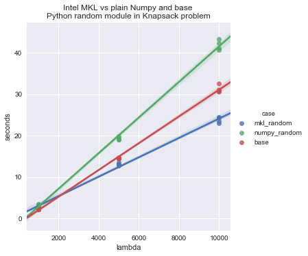

# Benchmarking Intel's Math Kernel Library-based Numpy psuedo-random number generator in evolutionary algorithms

DEAP is an evolutionary algorithm library. The master branch uses base Python pseudo-random number generator. A Numpy variant was introduced into the branch `numpy-random` which guarantees consistent seeding (see [issue #138](https://github.com/DEAP/deap/issues/138) for more information).

This `numpy-random-mkl` branch patches the `numpy.random.uniform` and other methods with the `mkl_random` methods, designed for Intel hardware, and improving speed up to 25% in the knapsack problem, for example.

## How it works

When `deap.algorithms` is loaded, if `MKL_RANDOM` is in the user's environment, numpy and base Python random methods are patched with the MKL methods.

## Benchmarking setup

Create two Python2 environments:

Intel MKL numpy and other dependencies:

```bash
conda create -n deap-mkl python=2 -c intel mkl_random
pip install git+https://github.com/JustinShenk/deap.git@numpy-random-mkl
```

Numpy-only setup:

```bash
conda create -n deap-numpy python=2
pip install git+https://github.com/JustinShenk/deap.git@numpy-random-mkl
```

Optional third environment can test the base Python random module:

```bash
conda create -n deap-base python=2
pip install deap
```

Run the script `python benchmark_mkl.py knapsack 1` to run the knapsack.py with various `lambda` parameters for 4 iterations. The `1` is a binary argument specifying whether the current environment is using the `numpy` random module or not. For the `deap-base` enviroment, run the command with `python benchmark_mkl.py knapsack 0`.

## Plot the results with the Jupyter notebook

Install seaborn, pandas and matplotlib for visualizing:

`pip install -r requirements.txt`

Open the notebook: `jupyter notebook`.

## Results

Knapsack problem with varying lambdas (number of individuals produced in each generation): 


